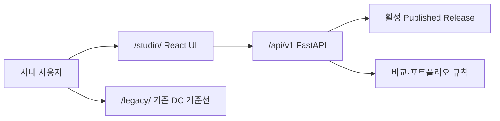

# P5 Catalog Audit Studio UI 설계

## 1. 목표

Samsung 내부 사용자가 **발행된 카탈로그를 안전하게 조회·점검**하는 View-first 앱을 만든다. 사용자는 현재 Release가 무엇인지 확인하고, 모델의 검증 상태·비교 가능성·포트폴리오 공백·원본 Evidence를 한 흐름에서 추적할 수 있어야 한다.

P5는 새 조사나 데이터 편집 도구가 아니다. UI 판단은 FastAPI가 반환한 활성 Published Release와 비교 판정을 그대로 표시한다.

## 2. 범위

### 포함

- Overview
- Catalog Checks
- Compare Lab
- Portfolio Gaps
- Release / Evidence
- Compare Report 명명 팝업
- 승인자·승인시각·Release ID·Git SHA·데이터 SHA 추적
- 390px 모바일과 1440px 데스크톱
- 기존 DC 대시보드와 신규 `studio/` 공존

### 제외

- UI에서 모델·수치 수정
- Staging Bundle 업로드
- Publish·Rollback 실행 버튼
- 로그인·역할 관리
- 실시간 협업, 알림, 코멘트
- 복잡한 차트 편집기와 사용자별 대시보드

승인자는 UI에서 새로 승인하는 사람이 아니라, Published Release에 이미 기록된 `approvedBy`를 조회하는 대상이다.

## 3. 실행 구조

React UI와 API는 같은 FastAPI 주소에서 제공한다. 브라우저는 상대경로 `/api/v1/...`만 호출하며 CORS 설정이나 별도 API 주소를 사용하지 않는다.

| 경로 | 역할 |
|---|---|
| `/?view=overview` | Overview |
| `/?view=checks` | Catalog Checks |
| `/?view=compare` | Compare Lab |
| `/?view=gaps` | Portfolio Gaps |
| `/?view=release` | Release / Evidence |
| `/compare-lab-output.html` | Compare Report 정적 팝업 |
| `/api/v1/*` | 현재 P4 View-first API |
| `/legacy/` | 변경하지 않은 기존 `frontend/` DC 대시보드 |

현재 `/`는 Studio를 제공하고 query parameter로 뷰를 전환한다. `/api/*`, `/legacy/*`, 확장자가 있는 정적 파일 요청을 React fallback이 가로채면 안 된다.

권장 구현은 `studio/` 아래 React + TypeScript + Vite다. 전역 상태 라이브러리는 추가하지 않고, 작은 `ReleaseContext`와 공통 `apiClient`만 사용한다.

## 4. 공통 화면 틀

### 데스크톱 1440px

- 왼쪽 240px 내비게이션: 5개 앱 뷰, Compare Report 팝업, 기존 DC 링크
- 상단 64px Release Bar: 활성 Release, 승인자, 검증 상태
- 본문 최대 폭 1200px, 12열 그리드
- 모델 상세와 Evidence는 오른쪽 Drawer로 열어 목록 맥락을 유지

### 모바일 390px

- 상단에 앱명, 활성 Release, 메뉴 버튼
- 메뉴 버튼은 5개 앱 뷰와 Compare Report를 표시하는 전체 폭 Drawer를 연다.
- 본문은 1열이며 카드 간격 12px, 좌우 여백 16px
- 비교 모델 선택은 위아래로 배치
- 넓은 표는 카드 목록으로 바꾼다. 꼭 필요한 표만 이름이 있는 내부 가로 스크롤을 허용한다.
- Evidence Drawer는 전체 화면으로 전환한다.

모든 터치 대상은 최소 44×44px로 한다. 390px에서 페이지 전체 가로 넘침은 0이어야 한다.

## 5. 5개 앱 뷰 + 1개 보고서 팝업

### 5.1 Overview

목적은 “현재 어떤 데이터가 발행되어 있고, 점검 결과가 안전한가?”를 10초 안에 파악하는 것이다.

- 활성 Release 카드: ID, 승인자, 승인시각, 기준일, Git SHA
- 모델 카드: 전체 76, Samsung 27, 경쟁사 49
- Validation 카드: Critical, Major, Warning
- 포트폴리오 주의 카드: R290 Re GAP 등 확정 공백
- 빠른 이동: Warning 보기, 비교 시작, Evidence 찾기

Critical 또는 Major가 1건 이상인 Release는 원래 발행될 수 없다. API에서 이런 상태가 오면 정상 카드 대신 “Release 무결성 확인 필요” 오류 화면을 표시한다.

### 5.2 Catalog Checks

목적은 자동 검증 결과를 모델과 필드 단위로 읽는 것이다.

- 상단 요약: `VALIDATED`, Critical 0, Major 0, Warning 수
- 필터: 심각도, 검사 코드, Samsung/경쟁사, 모델 검색
- 목록 열: 심각도, 코드, 메시지, 모델, 필드
- 행 선택 시 모델 요약과 Evidence Drawer 열기
- 결과 없음은 “현재 조건의 점검 이슈 없음”으로 표시

View-first이므로 수정·재검증 버튼은 두지 않는다. Warning은 숨기지 않으며 원본 위치를 함께 제공한다.

### 5.3 Compare Lab

목적은 Samsung 기준 모델과 경쟁 모델의 **비교 가능 여부부터** 확인하는 것이다.

1. Re/Ro/Sc 유형 선택
2. COP 또는 EER 선택
3. 해당 유형에서 직접 비교 후보가 있는 Samsung 기준 모델만 선택
4. 직접 비교 조건을 모두 만족하는 경쟁 모델만 선택
5. API 최종 판정 결과 표시

후보 필터는 동일 유형·냉매·측정조건·구동, 용량 ±15%, 선택 지표 보유를
확인한다. 직접 후보가 없는 Samsung 모델은 선택 목록에서 제외하고, 필요한
냉매·조건·구동·용량 범위·지표를 `공식 자료 리서치 큐`에 표시한다. 조건이
다른 경쟁 모델을 억지로 보여주지 않는다. API 비교 Gate는 실행 시 같은 규칙을
다시 확인하는 최종 권위다.

| 판정 | UI 표시 |
|---|---|
| `DIRECT` / `DIRECT_OK` | 두 원본값, 용량 차이, Delta, 순위 가능 배지 |
| `REFERENCE` | 참고 사유와 필요한 조건 배지. 순위·Delta·승패 문구 숨김 |
| `BLOCKED` | 차단 사유와 해결 방법. 순위·Delta·승패 문구 숨김 |

`rankingAllowed !== true`이면 `deltaPct` 값이 오더라도 UI는 표시하지 않는다. `REFERENCE_NORMALIZED_CONDITION`의 환산값은 “참고 환산값”으로만 표시하며 막대 길이, 순위, 우위 표현에 사용하지 않는다.

GAP 또는 UNKNOWN 포트폴리오에서는 가짜 Samsung 모델이나 0값을 만들지 않는다. R290 Re는 `PORTFOLIO GAP` 안내와 경쟁 모델 목록만 보여준다.

### 5.4 Portfolio Gaps

목적은 Samsung의 냉매 × Re/Ro/Sc 상태를 구분하는 것이다.

- 데스크톱: 냉매 행 × Re/Ro/Sc 열 매트릭스
- 모바일: 냉매별 접이식 카드 1열
- 상태: HAVE, IN_PROGRESS, GAP, UNKNOWN
- 셀 선택: Samsung 모델, 판단 근거, 관련 경쟁 모델, Evidence

GAP과 UNKNOWN은 다르다.

- GAP: 근거와 승인 기준에 따라 미보유가 확정됨
- UNKNOWN: 공개 자료만으로 판단 불가

R290 Re는 GAP, R290 Ro/Sc는 HAVE, R454B Ro/Sc는 HAVE가 회귀 없이 표시되어야 한다.

### 5.5 Release/Evidence

목적은 화면의 숫자가 어떤 Release와 원본에서 왔는지 확인하는 것이다.

- Release: ID, 상태, 활성화 시각, 승인자, 이전 Release
- 무결성: 데이터 SHA-256, Source Commit, Validation 요약
- 모델 검색
- Evidence Chain:
  `모델 → 활성 Release → sourcePath → PDF page/Markdown section → fieldPaths`
- 공식/보조/조사 출처 구분
- 경로 복사와 허용된 내부 원본 열기
- 직전 불변 Release 대비 추가·삭제·수치·Evidence·성능맵 변경 수
- 변경 모델과 field path; 배열은 전체 원문 대신 item count만 표시

예: `DS4BC7066FVT COP 3.25 → releaseId → Samsung-Compressor-Catalogue_2024.pdf → p.92`.

이 화면에는 Publish·Rollback 버튼을 두지 않는다.

### 5.6 Compare Report

사이드바의 6번째 항목은 앱 내부 라우트가 아니라 이름이 있는
`compareLabReport` 팝업으로 `/compare-lab-output.html`을 연다.

- 직접 비교 가능한 Samsung 8모델과 `DIRECT_OK` 15건만 표시
- 유형·COP/EER 필터, 양사 원값·경쟁사 Δ Recharts, 상세 카드 제공
- 공식 속도점이 양쪽에 있는 eligible 쌍만 RPM/RPS 차트 제공
- 비교 불가 모델과 `DATA_REQUIRED` 속도쌍은 보고서에서 제외
- 전체 비교 CSV, 속도 CSV, 인쇄/PDF, Compare Lab 복귀 링크 유지

## 6. 컴포넌트

| 컴포넌트 | 역할 |
|---|---|
| `AppShell` | 내비게이션, 모바일 메뉴, 본문 |
| `ReleaseBar` | 모든 화면에 활성 Release와 승인자 표시 |
| `PageHeader` | 화면 제목·설명·주요 액션 1개 |
| `KpiCard` | 수치, 단위, 기준 설명 |
| `FilterBar` | 검색과 열거형 필터 |
| `StatusBadge` | 양산·개발·GAP·UNKNOWN |
| `SourceLayerBadge` | 공식 2024·2024+ 개발·경쟁사 조사·Legacy 조사 |
| `ConditionBadge` | ARI, DOE-A, DOE-B, EN12900 등 측정조건 |
| `ValidationList` | 점검 이슈 목록 |
| `ModelPicker` | 기준·후보 모델 검색 선택 |
| `VerdictPanel` | DIRECT·REFERENCE·BLOCKED 결과 |
| `GapMatrix` | 냉매 × 유형 상태 |
| `EvidenceDrawer` | 출처, locator, 적용 필드 |
| `EmptyState` | 결과 없음과 다음 행동 |
| `ErrorState` | 503·404·무결성 오류 |
| `LoadingSkeleton` | 레이아웃이 흔들리지 않는 로딩 상태 |

같은 Badge와 판정 문구를 화면마다 새로 만들지 않는다. `VerdictPanel` 하나가 Compare Lab과 모델 상세에서 공통 규칙을 사용한다.

## 7. API 매핑

모든 응답의 `releaseId`는 현재 `ReleaseContext.activeReleaseId`와 같아야 한다. 다르면 기존 응답을 섞지 않고 활성 Release부터 다시 조회한다.

| 뷰/컴포넌트 | API | 사용 필드 |
|---|---|---|
| `ReleaseBar`, Overview | `GET /api/v1/releases/active` | releaseId, approvedBy, activatedAt, counts, validationSummary, sourceCommit, appGitSha |
| `Release / Evidence` Diff | `GET /api/v1/releases/active/diff` | fromReleaseId, toReleaseId, summary, changes, integrity |
| `Release / Evidence` B1 | `GET /api/v1/expansion/batches/B1` | 16행, 기존 연결 8, 신규 후보 8, 조건 UNKNOWN 16, NOT_PUBLISHED |
| Overview 모델 수 | `GET /api/v1/catalog/models` | count, items |
| Catalog Checks | `GET /api/v1/releases/active` | validationSummary.issues |
| 모델 검색·선택 | `GET /api/v1/catalog/models?...` | manufacturer, type, refrigerant, condition, driveClass, specs |
| 모델 상세 | `GET /api/v1/catalog/models/{modelId}` | item |
| Compare Lab 기존 판정 | `POST /api/v1/compare` | verdict, code, reason, rankingAllowed, deltaPct |
| Compare Lab 판정·분석 | `POST /api/v1/compare/report` | comparison, conditionSafety, performanceInterpretation, evidenceConfidence, evidenceRefs, portfolioImplications, recommendedActions, limitations |
| Gap 셀 상세 | `GET /api/v1/portfolio/{type}/{refrigerant}` | status, samsungModels, rankingAllowed, evidence |
| Evidence Drawer | `GET /api/v1/evidence/{modelId}` | evidence, supportingEvidence |
| 장애 확인 | `GET /api/v1/health` | status, activeReleaseId |

전체 Gap 매트릭스가 느릴 경우에만 `GET /api/v1/portfolio` 집계 API를 P5의 유일한 추가 읽기 API로 만든다. 첫 구현은 기존 셀 API를 사용하고, 성능 측정 전에는 새 API를 추가하지 않는다.

API 오류 처리:

- `503`: Staging이나 기존 JS로 대체하지 않고 “활성 Published Release 없음” 표시
- `404`: 선택 모델이 현재 Release에 없음을 표시하고 목록으로 복귀
- 네트워크 오류: 마지막 응답을 확정값처럼 표시하지 않고 재시도 버튼 제공
- Release ID 불일치: 모든 화면 데이터를 폐기하고 한 번 다시 로드

## 8. 상태·색상·배지

색은 기존 DC 토큰을 유지하되, 글자와 아이콘을 항상 함께 사용한다.

| 의미 | 색상 | 배지 문구 |
|---|---|---|
| Samsung / Re 강조 | `#FF385C` | Samsung, Re |
| Ro | `#00A699` | Ro |
| Sc | `#FC642D` | Sc |
| 양산/HAVE/DIRECT | `#067647` | 양산, 보유, 직접 비교 가능 |
| 개발중/REFERENCE | `#B25E00`, 보조 `#E8A100` | 개발중, 참고 비교 |
| BLOCKED/Critical | `#C13515` | 비교 차단, Critical |
| GAP/UNKNOWN | `#C4C4C4`, 글자 `#555555` | 공백, 미확인 |
| 기본 글자 | `#222222` | 해당 없음 |
| 보조 글자 | `#717171` | 해당 없음 |

조건 Badge는 성능 우열이 아니라 측정조건 표식이다. ARI는 파랑, DOE-A는 황갈색, DOE-B는 적갈색, 기타 조건은 회색 계열을 사용하되 `ARI`, `DOE-A`처럼 텍스트를 반드시 표시한다.

## 9. 접근성

- 각 뷰에 하나의 `h1`, 영역은 순서가 맞는 `h2`
- 내비게이션은 `<nav>`, 현재 항목은 `aria-current="page"`
- 폼에는 보이는 `<label>`, 관련 선택기는 `<fieldset>`과 `<legend>`
- 표에는 `<caption>`, 열 머리글은 `scope="col"`
- 판정 결과는 `aria-live="polite"`로 알림
- Drawer를 닫으면 열었던 행·버튼으로 포커스 복귀
- 키보드만으로 메뉴, 필터, 모델 선택, Evidence 열기 가능
- 포커스 테두리를 제거하지 않음
- 본문과 상태 Badge는 WCAG AA 명암비 충족
- 색상만으로 상태를 구분하지 않고 아이콘·문구·코드를 병기
- 그래프를 사용하면 같은 값을 표 또는 텍스트로 제공
- 로딩·빈 결과·오류 상태를 스크린리더가 구분할 수 있게 표시

## 10. 구현 순서

1. `studio/` 기본 구조, AppShell, 5개 뷰, ReleaseContext
2. API Client와 503·404·Release 불일치 처리
3. Overview와 Catalog Checks
4. Compare Lab 및 `VerdictPanel`
5. Portfolio Gaps와 Evidence Drawer
6. 390px·1440px 반응형과 접근성 보완
7. Vitest 및 Playwright Golden E2E
8. Compare Report 팝업과 기존 `/legacy/` 기준선 동시 검증

## 11. 테스트와 완료기준

### 컴포넌트/API

- 각 뷰의 Loading, Empty, Error, Success 상태
- `rankingAllowed=false`에서 순위·Delta DOM이 존재하지 않음
- DIRECT에서만 Delta 표시
- GAP과 UNKNOWN의 문구·아이콘이 다름
- 응답 Release ID가 다르면 혼합 표시하지 않음
- Evidence locator가 PDF page 또는 Markdown section까지 표시됨

### Golden E2E

- G1: R454B Sc Fixed DOE-B → DIRECT, Delta 표시
- G2: Samsung R32 Ro ARI 대 GMCC SEER60 → BLOCKED, 순위·Delta 없음
- G3: R290 Re → GAP, 가짜 Samsung 모델·0값·순위 없음
- G6: DS4BC7066FVT COP 3.25 → 활성 Release → 공식 PDF p.92 추적

### P5 Done

- 5개 앱 뷰와 Compare Report가 같은 활성 Published Release를 읽는다.
- 모든 뷰에 같은 Release ID와 승인자가 표시된다.
- BLOCKED와 REFERENCE에서 순위·Delta·승패 문구가 0건이다.
- 390×844와 1440×1024에서 페이지 가로 넘침 0, 핵심 기능 누락 0이다.
- 키보드 탐색과 주요 스크린리더 이름이 검증된다.
- 기존 `/legacy/` P0 기준선과 `/studio/`가 같은 서버에서 공존한다.
- API와 UI가 same-origin이며 외부 CDN 없이 clean build된다.
- Vitest, 전체 Python 회귀, Playwright가 PASS한다.
- 로컬 E2E 2회 연속과 GitHub Actions Chromium 1회가 PASS한다.
- Console error, page error, 실패한 앱 요청이 각각 0건이다.
- Critical 0, Major 0, P5 Eval score 4.7/5 이상이다.

## 12. 위험과 대응

- **Release 혼합 표시**: 모든 응답의 `releaseId`를 비교하고 불일치 시 전체 재조회
- **차단 비교의 시각적 오해**: 결과 영역에서 순위·Delta DOM 자체를 만들지 않음
- **기존 화면 회귀**: `frontend/`를 import하거나 수정하지 않고 `/legacy/`로 별도 제공
- **모바일 표 넘침**: 카드 전환을 우선하고 필요한 표만 내부 스크롤
- **기능 확장 과다**: 편집·발행·권한·알림은 P5 범위 밖으로 유지
